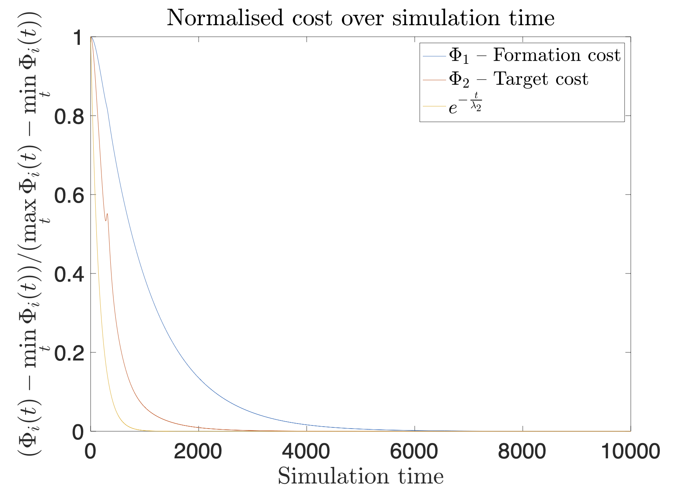
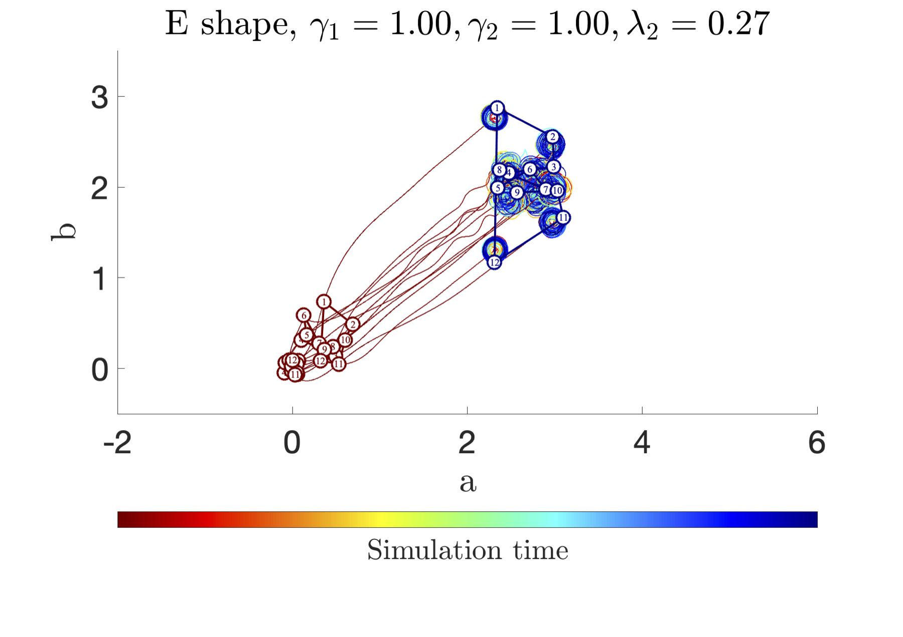

# Distributed Feedback Optimisation for Robotics Coordination


Feedback optimisation is an emerging technique to steer a system to an optimal steady state for a given objective function. We show that it is possible to employ this control strategy in a distributed manner to coordinate a swarm of agents for moving in formation towards a target. Moreover, we prove that the asymptotic convergence to the set of optimal configurations is guaranteed. Finally, we analyse the topological structure of the specified formation to derive sufficient conditions on the convergence of the swarm in formation around the desired target location.

The paper is available [here](paper.pdf).

#### Table of contents
1. [Getting started](#getstarted)
2. [Simulations](#examples)
3. [Citation](#license)

<a name="getstarted"></a>
## Getting started
The code run and has been tested with MATLAB R2021a. The following licenses are required:

|Toolbox|
|:----- |
|simulink|
|symbolic_toolbox|

The above set of toolbox has been determined with the `license('inuse')` command at the end of the simulation. The code was developed having access at all the toolboxes.

1. Clone the repo.
2. Select the task to perform in `runFormationSimulink.m`. See [Simulations](#examples) for further details.
3. Just run `runFormationSimulink` in the console.

<a name="examples"></a>
## Simulations

### Pentagon formation
Selecting `task1` in `runFormationSimulink.m` the agents start from random positions in a neighbourhood of the origin, they assemble in a pentagon formation and move together towards the specified target location.


In the above figure, one can appreciate the time evolution considering the change in colour. It is apparent that the specified cost function guarantees that the agents do not only drive to the target location before assembling in formation, but they do so early on. Hence, the desired transient behaviour is empirically obtained. Characterising it quantitatively is still an open question and a topic of ongoing research. However, in the next image the evolution over time of the two terms of the cost function is shown.



The resemblance to an exponential decrease is apparent from the juxtaposition with the exp(-t/lambda2), lambda2 being the algebraic connectivity of the specified pentagon formation. Indeed, we intuitively expect the decrease rate to be somehow related to the gains of the cost function and the algebraic connectivity of the formation graph.

### E formation
Selecting `task2` in `runFormationSimulink.m` the agents start from random positions in a neighbourhood of the origin, they assemble in a pentagon formation and move together towards the specified target location.

In the next two figures the simulations of the robotics swarm with different values for the cost function gains are shown.




It is apparent that the conditions of Theorem III.2 are not fulfilled in the last image and the final configuration of the agents is indeed not the desired one. On the other hand, we empirically notice that a factor of of 10 is enough to obtain the desired result in the former figure.


<a name="license"></a>
## Citation
This code implements the event-based visual odometry pipeline described in the paper [EVO: A Geometric Approach to Event-Based 6-DOF Parallel Tracking and Mapping in Real-time](http://rpg.ifi.uzh.ch/docs/RAL16_EVO.pdf) by [Antonio Terpin](), [Sylvain Fricker]() and [Michel Perez]().

If you use any of this code, please cite the following:
```bibtex
@Article{DistributedCoordination,
  author        = {Terpin, Antonio and Fricker, Sylvain and Perez, Michel},
  title         = {Distributed Feedback Optimisation for Robotics Coordination}, 
  year          = {2021},
  url           = {https://github.com/antonioterpin/feedback-optimization-swarm-robotics}
}
```

The license is available [here](LICENSE).
